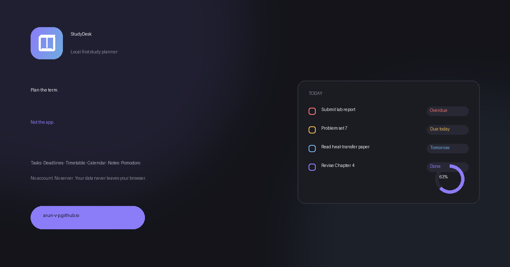

<div align="center">

<!-- Replace with a real screenshot — see "Assets to add" below. -->


# StudyDesk

**A local-first study planner. Tasks, deadlines, timetable, calendar, notes and a Pomodoro timer — no account, no server, no tracking.**

[](https://arun-v-p.github.io/StudyDesk/)
[](./.github/workflows/deploy.yml)
[](./tests)
[](./tsconfig.json)
[](#accessibility)

</div>

---

## Why StudyDesk

Most study apps want an account, a subscription, or both. StudyDesk keeps everything in your
browser's local storage: it loads instantly, works offline, and your data never leaves your
machine. What it trades away is sync between devices — [export and import](#data) is the bridge.

## Features

|                 |                                                                                                                                                           |
| --------------- | --------------------------------------------------------------------------------------------------------------------------------------------------------- |
| **Today**       | One screen: open tasks, approaching deadlines, today's classes on a timeline, pinned notes, and a completion ring                                         |
| **Deadlines**   | Grouped Overdue / Today / Tomorrow / Upcoming, counted down to the minute, with priority and relative time                                                |
| **Timetable**   | Weekly grid on a real time axis — half-hour starts, multi-hour spans and overlapping classes all render, colour-coded per subject, with a live "now" line |
| **Calendar**    | Month grid with adjacent-month days, priority-accurate dots, and a planner layer for personal / academic / work / health entries                          |
| **Focus timer** | Drift-free Pomodoro, persisted daily session count, long-break cycle, tab-title countdown, `Space` to start/pause, completion chime                       |
| **Notes**       | Pinnable, tag-filterable, full-text search, relative timestamps                                                                                           |
| **Search**      | `⌘K` palette across every entity and page                                                                                                                 |
| **Local-first** | Validated, versioned storage with cross-tab sync, JSON export/import, and a storage meter                                                                 |

## Screenshots

| Today                                  | Timetable                                      | Calendar                                     |
| -------------------------------------- | ---------------------------------------------- | -------------------------------------------- |
|    |    |    |
|  |  |  |

## Getting started

```bash
git clone https://github.com/arun-v-p/StudyDesk.git
cd StudyDesk
npm install
npm run dev        # http://localhost:3000
```

Requires Node.js 20.19+ or 22.12+.

| Script              | Purpose                               |
| ------------------- | ------------------------------------- |
| `npm run dev`       | Dev server                            |
| `npm run build`     | Typecheck, then build to `dist/`      |
| `npm run preview`   | Serve the production build            |
| `npm run typecheck` | `tsc --noEmit`                        |
| `npm run lint`      | ESLint (`jsx-a11y`, `react-hooks`)    |
| `npm run format`    | Prettier, with Tailwind class sorting |
| `npm test`          | 80 unit + integration tests           |
| `npm run ci`        | Everything CI runs, in order          |

## Architecture

```
src/
├─ main.tsx                     # StrictMode, legacy-key migration, theme bootstrap
├─ App.tsx                      # HashRouter + lazy routes + per-route ErrorBoundary
├─ theme.css                    # design tokens: colour, type, radius, elevation, motion
├─ types.ts                     # domain model
├─ lib/
│  ├─ dates.ts                  # LOCAL day keys, HH:mm parsing, time-aware sort keys
│  ├─ status.ts                 # one deadline-status + relative-time implementation
│  └─ id.ts                     # crypto.randomUUID()
├─ store/
│  ├─ usePersistentState.ts     # validated, versioned, debounced, cross-tab synced
│  ├─ AppStore.tsx              # single context; no prop drilling
│  ├─ validators.ts             # per-record shape checks
│  ├─ legacyMigration.ts        # flat keys -> namespaced, non-destructive
│  ├─ backup.ts                 # export / import
│  └─ seed.ts                   # opt-in sample term
├─ features/
│  ├─ timetable/layout.ts       # pure time-axis layout engine
│  └─ timer/usePomodoro.ts      # deadline-timestamp driven
├─ hooks/                       # useNow, useTheme
├─ components/
│  ├─ ui/                       # Field, IconButton, Modal, ConfirmDialog, Toast, Card, EmptyState
│  ├─ layout/                   # AppShell, Sidebar, Topbar
│  ├─ SearchPalette.tsx         # ⌘K
│  └─ ErrorBoundary.tsx
└─ pages/                       # Today, Deadlines, Timetable, Calendar, Timer, Notes, Settings, NotFound
```

Three rules, each one a bug that existed before:

- **Dates are local.** `new Date(y,m,d).toISOString()` shifts back a day in any UTC+ timezone. Day keys always come from `lib/dates.ts`.
- **Colour comes from tokens.** No hex literals in components. `theme.css` is the only place a colour is defined — which is what makes re-theming a two-line change.
- **Layout is derived from data.** The timetable axis comes from your entries, never a hardcoded slot list.

## Data

Stored under `studydesk.*` keys inside a `{ v: 1, data: … }` envelope. Records failing validation
are dropped individually and reported, rather than crashing the app. To change a shape: bump
`SCHEMA_VERSION` and append a migration — existing users are carried over.

**Export regularly.** Local storage is per-browser and per-origin; clearing site data or switching
devices starts from empty. Settings → Export writes a JSON backup, and Import validates the whole
file before writing anything.

Upgrading from the previous build? `legacyMigration.ts` copies your existing `studydesk_*` records
into the new format on first launch, idempotently and without deleting the originals. See
[MIGRATION.md](./MIGRATION.md).

## Accessibility

Target WCAG 2.2 AA. Concretely, and enforced in CI by `eslint-plugin-jsx-a11y`:

- Every foreground/background pair ≥ 4.5:1; lightest body text is 5.00:1
- Form controls use a border at ≥ 3:1 (WCAG 1.4.11)
- Focus is never suppressed — one global `:focus-visible` ring at ≥ 3:1 against both surface and page background (2.4.7)
- Every icon-only button has an `aria-label`; `IconButton` makes it a **required prop**, so an unnamed button will not compile
- Every input has a real `<label>` via `Field`, with `aria-invalid` and `role="alert"` errors
- Row actions appear on hover, `:focus-within`, **and** `(hover: none)` — touch users can reach edit and delete
- Touch targets ≥ 40px (2.5.8 minimum is 24px)
- `prefers-reduced-motion` disables all animation
- Modals and the drawer trap focus, close on Escape, and restore focus
- Destructive actions are undoable from a toast

## Deployment

GitHub Actions runs `lint → format:check → typecheck → test → build` on every push and PR, then
deploys `main` to GitHub Pages. A failing check cannot reach production.

`base` and the canonical/OG URLs derive from `GITHUB_REPOSITORY`, so the site keeps working if the
repo is renamed or moved to a custom domain — override with `VITE_SITE_URL` in `.env.local`.

## Tests

80 tests across 6 files. They are written as **regression tests for specific defects**, so the
comments name what each one prevents:

- `timetableLayout.test.ts` — half-hour starts, multi-hour spans, overlap lanes never colliding, unrenderable entries reported rather than hidden
- `status.test.ts` — time-aware overdue detection, same-day ordering by time, local day keys across a UTC boundary
- `usePersistentState.test.ts` — the 9 malformed payloads that white-screened the previous build, plus quota-failure reporting
- `legacyMigration.test.ts` — idempotent, non-clobbering, retryable
- `seed.test.ts` — sample data stays valid and current
- `app.test.tsx` — routing, `aria-current`, first-run empty state, and two invariants: **no unnamed icon button** and **no `focus:outline-none`**

## Tech debt

Tracked openly rather than left to rot: see the audit that motivated this rewrite, and
[MIGRATION.md §6](./MIGRATION.md#6-known-gaps) for what is still open.

## Contributing

```bash
npm install
npm run dev          # develop
npm run ci           # must pass before opening a PR
```

Add a test with any behaviour change. `features/timetable/layout.ts` and `lib/status.ts` are pure
functions and the easiest places to start.

---

### Assets to add

Referenced above but not in the repo — capture these from the running app:

| Path                              | What                                                                     |
| --------------------------------- | ------------------------------------------------------------------------ |
| `docs/today-{dark,light}.png`     | Today dashboard, both themes, 2x                                         |
| `docs/timetable-{dark,light}.png` | Timetable with overlapping + half-hour classes                           |
| `docs/calendar-{dark,light}.png`  | Month view with dots                                                     |
| `public/og-image.png`             | Currently a generated stand-in; replace with a real screenshot composite |

Seed a sample term (Settings → Load sample term) before capturing, so the screens look populated.
