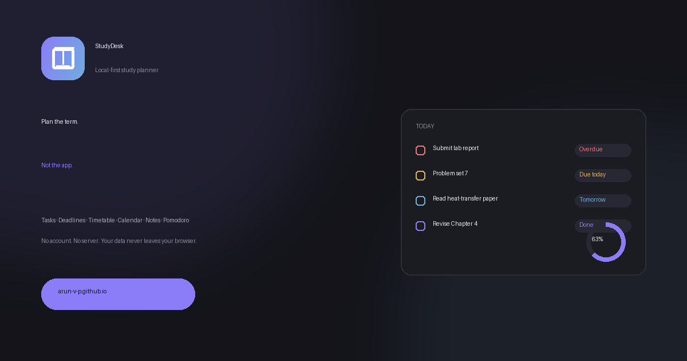

<div align="center">

<!-- Replace with a real screenshot — see "Assets to add" below. -->


# StudyDesk

**A local-first study planner. Tasks, deadlines, timetable, calendar, notes and a Pomodoro timer — no account, no server, no tracking.**

[](https://arun-v-p.github.io/StudyDesk/)
[](./.github/workflows/deploy.yml)
[](./tests)
[](./tsconfig.json)
[](#accessibility)

</div>

---

## Why StudyDesk

Most study apps want an account, a subscription, or both. StudyDesk keeps everything in your
browser's local storage: it loads instantly, works offline, and your data never leaves your
machine. What it trades away is sync between devices — [export and import](#data) is the bridge.

## Features

|                        |                                                                                                                                                           |
| ---------------------- | --------------------------------------------------------------------------------------------------------------------------------------------------------- |
| **Today**              | One screen: open tasks, approaching deadlines, today's classes on a timeline, pinned notes, and a completion ring                                         |
| **Deadlines**          | Grouped Overdue / Today / Tomorrow / Upcoming, counted down to the minute, with priority and relative time                                                |
| **Timetable**          | Weekly grid on a real time axis — half-hour starts, multi-hour spans and overlapping classes all render, colour-coded per subject, with a live "now" line |
| **Calendar**           | Month grid with adjacent-month days, priority-accurate dots, and a planner layer for personal / academic / work / health entries                          |
| **Focus timer**        | Drift-free Pomodoro, persisted daily session count, long-break cycle, tab-title countdown, `Space` to start/pause, completion chime                       |
| **Notes**              | Pinnable, tag-filterable, full-text search, relative timestamps                                                                                           |
| **Revision plans**     | Local exam plans with linked subjects/materials, deterministic review sessions, completion tracking, and manual rescheduling                              |
| **iCalendar**          | Selective `.ics` export and preview-first import for calendar events and weekly classes                                                                   |
| **Shareable resources** | Preview-first, local JSON export/import for study links; tags are opt-in and duplicates are never overwritten                                            |
| **Semester templates** | Reusable named weekly-timetable snapshots with preview and selective application                                                                          |
| **Installable PWA**    | Standalone install, offline app shell, and explicit user-controlled app updates                                                                           |
| **Search**             | `⌘K` palette across every entity and page                                                                                                                 |
| **Local-first**        | Validated, versioned storage with cross-tab sync, JSON export/import, and a storage meter                                                                 |

### Revision scheduling rules

Revision plans use local calendar dates and a timezone-free local exam datetime (`yyyy-MM-dd'T'HH:mm`);
they never convert the exam date through UTC. Generation creates one session per selected subject,
spaces those sessions evenly across eligible calendar days, and uses at most one generated session
per day. The eligible range starts today and ends the day before the exam; weekends are included and
no timetable/availability conflicts are inferred. Sessions normally start at 09:00. If generated
today, the start moves to the next half-hour slot and today is eligible only when the full target
duration fits before 22:00.

An exam today or in the past has no eligible study days. If there are fewer eligible days than
selected subjects, generation stops and reports the available-day count rather than stacking
sessions or silently omitting a subject. Editing plan inputs regenerates its schedule while
preserving completion history for subjects that remain selected. After generation, each session can
be completed, edited, rescheduled, or removed; rescheduling is limited to today through the day
before the exam. A session moved to today cannot use an elapsed start time, and edited sessions must
finish by 22:00. Plans with unfinished sessions after the exam are marked overdue in the plan view.

Plans, subject/material references, and session records are stored locally and included in backup
export/import. Sessions are independent records within a plan, leaving room for future optional
review methods or card references; flashcards and spaced-repetition behavior are not implemented.

### iCalendar portability boundaries

The Calendar page imports and exports `.ics` files without a server. Export selection includes
weekly timetable classes, exam timetable entries, deadlines, planner entries, and imported events.
Calendar items can be selected individually before download. Imports show a preview and diagnostics
before any local data is changed.

- **Recurring events:** weekly rules with an interval of one and optional `BYDAY` are imported as
  recurring weekly timetable classes. Timed weekly rules only are supported. Daily/monthly/yearly,
  bounded (`COUNT`/`UNTIL`), exception (`EXDATE`/`RDATE`), and more complex recurrence rules are
  skipped with a reason. Weekly classes export as unbounded weekly rules.
- **All-day events:** imported `DTEND` follows iCalendar's exclusive end-date convention; if absent,
  a one-day duration is assumed. All-day values remain local calendar dates.
- **Timezones:** floating date-times stay at the same local wall time. UTC offsets and IANA `TZID`
  values are converted to the browser's local timezone. Custom `VTIMEZONE` definitions are not
  interpreted; unknown/unresolvable zones are skipped and reported.
- **Duplicates:** likely duplicates (source UID, or matching title/date/time) are excluded by
  default in the import preview. A user may explicitly opt to add them as separate new records.
  Imports never update or delete existing records.
- **Unsupported fields:** common metadata is ignored; unrecognized event properties are listed in
  preview notes. Malformed or unsupported events are skipped and shown with event-specific reasons.

This is the tested StudyDesk subset of iCalendar, not a claim of complete RFC 5545 interoperability.

### Semester templates

Templates are named snapshots of the weekly timetable only (not deadlines, calendar events, exams,
or revision plans). Names are trimmed, limited to 60 characters, and unique without regard to case.
Before applying, preview the classes and select which to use. Starting a new semester replaces the
current timetable only after a second confirmation; append mode skips exact duplicates. Applied
classes receive new IDs, so editing the new timetable never changes its source template. Templates
can be renamed or deliberately refreshed from the current timetable and are included in local backup.

### Installable offline app

The production HTTPS deployment (and localhost preview) exposes the web manifest and registers a
service worker. The build emits a service-worker cache version from the worker implementation and
public shell asset contents.
Installation pre-caches only the app document, hashed JS/CSS, manifest, and public icons—not
localStorage, IndexedDB, backups, attachments, or other user data.

Navigation and hashed public assets use the current build's cache first; the cache lookup ignores
query strings and response `Vary` headers only for known static files. A new build is downloaded
and staged in a waiting worker. StudyDesk checks for an update at app startup; the user must choose
**Update app** before the new worker takes control and the page reloads. Activation removes the
previous StudyDesk shell cache. Offline support requires the app shell to have been opened online
once; if it was not cached, the browser receives an explanatory offline page rather than a blank app.

## Screenshots

| Today                                  | Timetable                                      | Calendar                                     |
| -------------------------------------- | ---------------------------------------------- | -------------------------------------------- |
|    |    |    |
|  |  |  |

## Getting started

```bash
git clone https://github.com/arun-v-p/StudyDesk.git
cd StudyDesk
npm install
npm run dev        # http://localhost:3000
```

Requires Node.js 20.19+ or 22.12+.

| Script              | Purpose                               |
| ------------------- | ------------------------------------- |
| `npm run dev`       | Dev server                            |
| `npm run build`     | Typecheck, then build to `dist/`      |
| `npm run preview`   | Serve the production build            |
| `npm run typecheck` | `tsc --noEmit`                        |
| `npm run lint`      | ESLint (`jsx-a11y`, `react-hooks`)    |
| `npm run format`    | Prettier, with Tailwind class sorting |
| `npm test`          | Unit + integration tests              |
| `npm run ci`        | Everything CI runs, in order          |

## Architecture

```
src/
├─ main.tsx                     # StrictMode, legacy-key migration, theme bootstrap
├─ App.tsx                      # HashRouter + lazy routes + per-route ErrorBoundary
├─ theme.css                    # design tokens: colour, type, radius, elevation, motion
├─ types.ts                     # domain model
├─ lib/
│  ├─ dates.ts                  # LOCAL day keys, HH:mm parsing, time-aware sort keys
│  ├─ status.ts                 # one deadline-status + relative-time implementation
│  └─ id.ts                     # crypto.randomUUID()
├─ store/
│  ├─ usePersistentState.ts     # validated, versioned, debounced, cross-tab synced
│  ├─ AppStore.tsx              # single context; no prop drilling
│  ├─ validators.ts             # per-record shape checks
│  ├─ legacyMigration.ts        # flat keys -> namespaced, non-destructive
│  ├─ backup.ts                 # export / import
│  └─ seed.ts                   # opt-in sample term
├─ features/
│  ├─ timetable/layout.ts       # pure time-axis layout engine
│  ├─ ics/                      # bounded iCalendar parser, exporter and preview workflow
│  ├─ semester/                 # timetable snapshot rules and application UI
│  └─ timer/usePomodoro.ts      # deadline-timestamp driven
├─ hooks/                       # useNow, useTheme
├─ components/
│  ├─ ui/                       # Field, IconButton, Modal, ConfirmDialog, Toast, Card, EmptyState
│  ├─ layout/                   # AppShell, Sidebar, Topbar
│  ├─ SearchPalette.tsx         # ⌘K
│  └─ ErrorBoundary.tsx
└─ pages/                       # Today, Deadlines, Timetable, Calendar, Timer, Notes, Settings, NotFound
```

Three rules, each one a bug that existed before:

- **Dates are local.** `new Date(y,m,d).toISOString()` shifts back a day in any UTC+ timezone. Day keys always come from `lib/dates.ts`.
- **Colour comes from tokens.** No hex literals in components. `theme.css` is the only place a colour is defined — which is what makes re-theming a two-line change.
- **Layout is derived from data.** The timetable axis comes from your entries, never a hardcoded slot list.

## Data

Stored under `studydesk.*` keys inside a `{ v: 1, data: … }` envelope. Records failing validation
are dropped individually and reported, rather than crashing the app. To change a shape: bump
`SCHEMA_VERSION` and append a migration — existing users are carried over.

**Export regularly.** Local storage is per-browser and per-origin; clearing site data or switching
devices starts from empty. Settings → Export writes a complete portable ZIP archive containing
metadata and Study Materials files. Each archive entry has a SHA-256 digest and restore validates
the full archive before replacing anything. Older JSON metadata backups remain importable, but
cannot restore attachment files.

Upgrading from the previous build? `legacyMigration.ts` copies your existing `studydesk_*` records
into the new format on first launch, idempotently and without deleting the originals. See
[MIGRATION.md](./MIGRATION.md).

Study Materials also supports an explicit shareable link list. Its versioned schema, privacy
boundaries, URL validation, and import behavior are documented in
[docs/shareable-resource-list.md](./docs/shareable-resource-list.md). This transfer is local-file
only and never includes attachment contents.

## Accessibility

Target WCAG 2.2 AA. Concretely, and enforced in CI by `eslint-plugin-jsx-a11y`:

- Every foreground/background pair ≥ 4.5:1; lightest body text is 5.00:1
- Form controls use a border at ≥ 3:1 (WCAG 1.4.11)
- Focus is never suppressed — one global `:focus-visible` ring at ≥ 3:1 against both surface and page background (2.4.7)
- Every icon-only button has an `aria-label`; `IconButton` makes it a **required prop**, so an unnamed button will not compile
- Every input has a real `<label>` via `Field`, with `aria-invalid` and `role="alert"` errors
- Row actions appear on hover, `:focus-within`, **and** `(hover: none)` — touch users can reach edit and delete
- Touch targets ≥ 40px (2.5.8 minimum is 24px)
- `prefers-reduced-motion` disables all animation
- Modals and the drawer trap focus, close on Escape, and restore focus
- Destructive actions are undoable from a toast

## Deployment

GitHub Actions runs `lint → format:check → typecheck → test → build` on every push and PR, then
deploys `main` to GitHub Pages. A failing check cannot reach production.

`base` and the canonical/OG URLs derive from `GITHUB_REPOSITORY`, so the site keeps working if the
repo is renamed or moved to a custom domain — override with `VITE_SITE_URL` in `.env.local`.

## Tests

117 tests across 18 files. They are written as **regression tests for specific defects**, so the
comments name what each one prevents:

- `timetableLayout.test.ts` — half-hour starts, multi-hour spans, overlap lanes never colliding, unrenderable entries reported rather than hidden
- `status.test.ts` — time-aware overdue detection, same-day ordering by time, local day keys across a UTC boundary
- `usePersistentState.test.ts` — the 9 malformed payloads that white-screened the previous build, plus quota-failure reporting
- `legacyMigration.test.ts` — idempotent, non-clobbering, retryable
- `ics.test.ts` / `icsTransfer.test.tsx` — supported calendar constructs, escaping/folding, skipped rules, preview and non-overwriting import
- `semesterTemplates.test.ts` / `semesterTemplatesPage.test.tsx` — snapshots, duplicate names, selective application, edits that leave templates unchanged
- `backup.test.tsx` — round-trips imported events and semester templates
- `seed.test.ts` — sample data stays valid and current
- `app.test.tsx` — routing, `aria-current`, first-run empty state, and two invariants: **no unnamed icon button** and **no `focus:outline-none`**

## Tech debt

Tracked openly rather than left to rot: see the audit that motivated this rewrite, and
[MIGRATION.md §6](./MIGRATION.md#6-known-gaps) for what is still open.

## Contributing

```bash
npm install
npm run dev          # develop
npm run ci           # must pass before opening a PR
```

Add a test with any behaviour change. `features/timetable/layout.ts` and `lib/status.ts` are pure
functions and the easiest places to start.

---

### Assets to add

Referenced above but not in the repo — capture these from the running app:

| Path                              | What                                                                     |
| --------------------------------- | ------------------------------------------------------------------------ |
| `docs/today-{dark,light}.png`     | Today dashboard, both themes, 2x                                         |
| `docs/timetable-{dark,light}.png` | Timetable with overlapping + half-hour classes                           |
| `docs/calendar-{dark,light}.png`  | Month view with dots                                                     |
| `public/og-image.png`             | Currently a generated stand-in; replace with a real screenshot composite |

Seed a sample term (Settings → Load sample term) before capturing, so the screens look populated.
